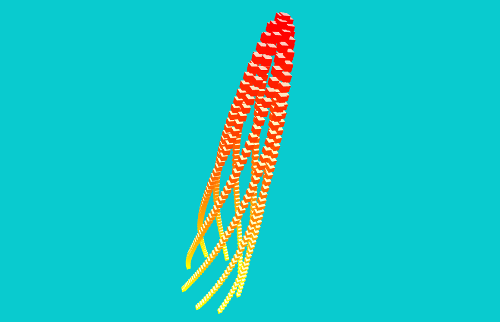
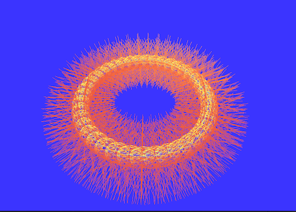

This repository contains my exercises for the [Graphics Codex](http://graphicscodex.com/projects/projects/) online [book](http://graphicscodex.com/).

## List of Projects

### Cubes

App: 01Cubes

Notes: This project contains the app that was used as example for the  [ofxPhyllotaxis](https://github.com/edap/ofxPhyllotaxis) addon.

### Meshes

App: 02Meshes

Notes: This project contains one of the app that was used as example for the  [ofxBranchesPrimitive](https://github.com/edap/ofxBranchesPrimitive) addon.

### Rays

Notes: This app is a WIP. The Cornell Box model comes from [McGuire2017] Morgan McGuire, Computer Graphics Archive, July 2017 (https://casual-effects.com/data)

App: 03Rays

### Paths

App:

